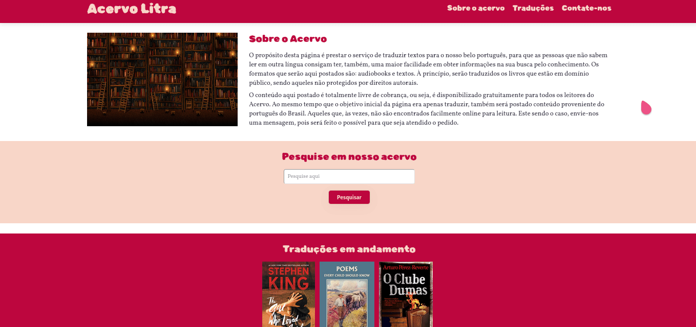

# Primeiro projeto do curso de Engenheiro Front-End da EBAC

Para esse primeiro projeto, construí um site de literatura com seções que falam sobre o objetivo da página, mostram alguns trabalhos do Acervo Litra e também uma seção para contato, contendo formulário e ícones para redes sociais. Pretendo melhorar o site posteriormente e deixá-lo ainda mais bonito e com um UX interessante.
